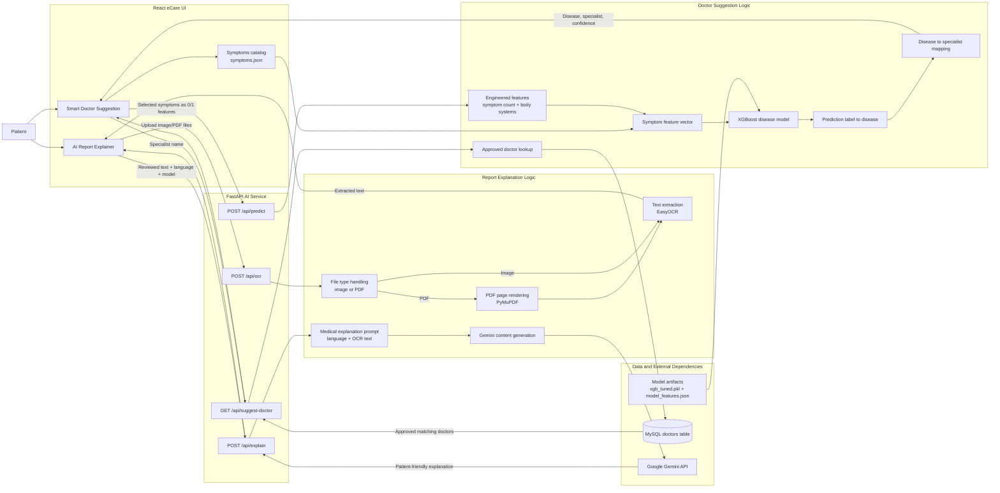
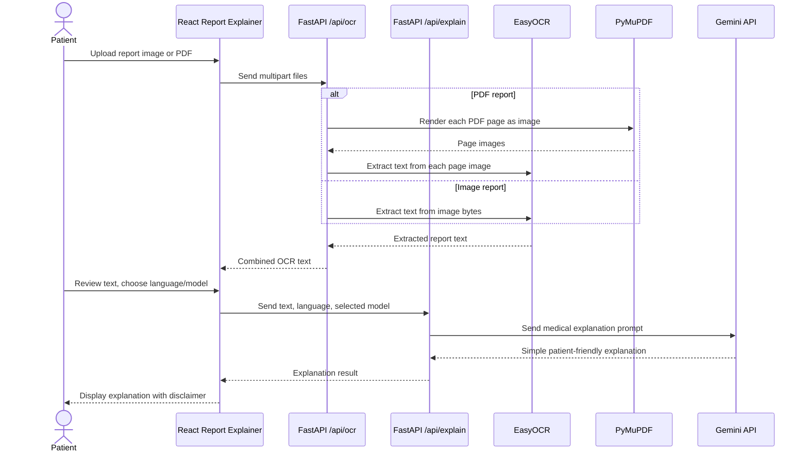
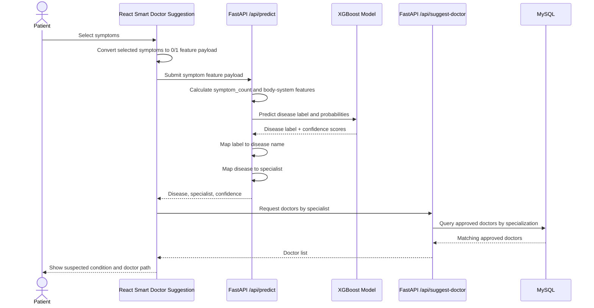
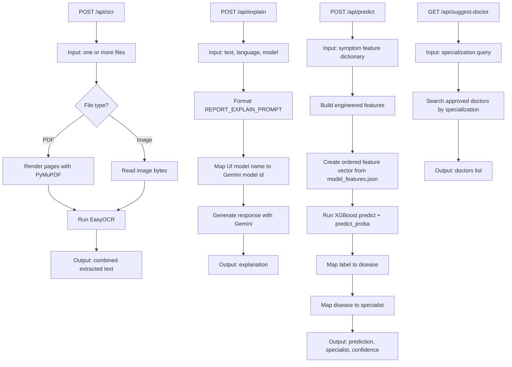

# AI Features - Logic Architecture

This diagram focuses only on the AI feature logic. It does not describe folder structure, UI styling, or the full appointment/payment system.

## AI Feature Boundary

## Report Explainer Flow

## Smart Doctor Suggestion Flow

## Endpoint Logic Map

## Core Logic Rules

- The React UI is responsible for collecting user input, building request payloads, and displaying AI results.
- The FastAPI service owns all AI logic: OCR, prompt construction, model inference, disease mapping, specialist mapping, and doctor lookup.
- OCR is a two-step pipeline for PDFs: render pages first, then run OCR on page images.
- Report explanation uses OCR text plus the selected language to produce a patient-friendly response through Gemini.
- Disease prediction uses the selected symptoms, engineered symptom/body-system features, and the saved XGBoost model artifacts.
- Doctor suggestions are not generated by the model directly. The model predicts a disease, the backend maps it to a specialist, then the backend queries approved doctors from MySQL.
- The AI output is advisory only and should remain paired with a medical disclaimer in the UI.
